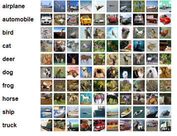
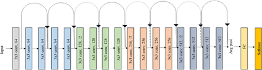

<dl>
  <h1> Comparison: Convolution, Involution, CondConv </h1>
  
The traditional architecture of the Convolution Neural Network (CNN) has been one of the most common and powerful neural networks, especially for dealing with image information. However, some of its shortcomings, such as redundant filters and parameters, are believed to exist, contributing to unnecessary computation, and reducing the efficiency of the network. Dynamic neural networks, on the other hand, provide a more flexible architecture based on different samples. 

  
In this report, traditional Convolution as well as the other two pixel-wise dynamic networks, specifically, Involution and Conditionally Parameterized Convolutions (CondConv), are introduced. An experiment will be conducted on the dataset Cifar-10 to compare the efficiency and performance of distinct networks. 

  
 Find the three text files appended to view more results.

  <h2>Cifar-10</h2>
  
Cifar-10 is a ten-class image dataset with 60,000 pictures. Each image is in size of 28x28 with 3 channels, and each of the class has 6,000 samples.

  
  <h2>Convolution</h2>
  
 ResNet18 is used. 

  
  <h2>Involution</h2>
  
 We adjust ResNet18 by replacing the second layer of each basic block to be an Involution layer. 

  
  <h2>Convolution</h2>
  
 We adjust ResNet18 by replacing the second layer of each basic block to be an CondConv layer. 

  
  <h2>Result</h2>
  
</dl>
